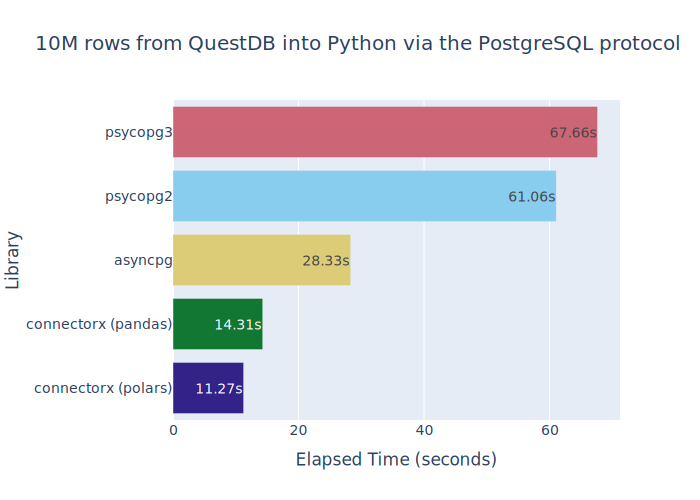

# QuestDB Database Connectivity Benchmarks

This repository contains simple "select * from cpu" (a table with 10M rows)
to benchmark throughput performance of various Python PG database drivers.

## Running the Benchmarks

To run you need to first install the `uv` package manager from
https://docs.astral.sh/uv/getting-started/installation/.

```bash
$ git clone https://github.com/amunra/qdbc/
$ cd qdbc
$ ./qdbc --help
                                                                                            
 Usage: qdbc [OPTIONS] COMMAND [ARGS]...                                                    
                                                                                            
╭─ Options ──────────────────────────────────────────────────────────────────────────╮
│ --help          Show this message and exit.                                        │
╰────────────────────────────────────────────────────────────────────────────────────╯
╭─ Commands ─────────────────────────────────────────────────────────────────────────╮
│ load              Load test data into QuestDB.                                     │
│ bench_psycopg2    Benchmark the psycopg2 library by fetching data from QuestDB.    │
│ bench_psycopg3    Benchmark the psycopg3 library by fetching data from QuestDB.    │
│ bench_asyncpg     Benchmark the asyncpg library by fetching data from QuestDB.     │
│ bench_cx_polars   Benchmark the connectorx to polars library by fetching data from │
│                   QuestDB.                                                         │
│ bench_cx_pandas   Benchmark the connectorx to pandas library by fetching data from │
│                   QuestDB.                                                         │
╰────────────────────────────────────────────────────────────────────────────────────╯
```

**N.B.** Each subcommand takes a `--help` option if you need to specify a different
host or port.

## Loading the test data

The `load` commands generates 10M rows of test data (just over 4GB).
The test data replicates the TSBS (Time Series Benchmark Suite) CPU table.

The opensource version of QuestDB was running with default config settings
on localhost.

```bash
$ ./qdbc load --send
```

## Results

The results have been run on a 16-core AMD Ryzen 9 5950X CPU with 64GB of RAM
and a 2TB NVMe SSD on Ubuntu 24.10.



### psycopg2

```bash
$ ./qdbc bench_psycopg2
Elapsed time: 61.06 seconds processing 10000000 rows
```

### psycopg3

```bash
$ ./qdbc bench_psycopg3
Elapsed time: 67.66 seconds processing 10000000 rows
```

### asyncpg

```bash
$ ./qdbc bench_asyncpg
Elapsed time: 28.33 seconds processing 10000000 rows
```

### connectorx to pandas    

```bash
$ ./qdbc bench_cx_pandas
/home/adam/misc/qdbc/.venv/lib/python3.13/site-packages/connectorx/__init__.py:478: FutureWarning: DatetimeArray.__init__ is deprecated and will be removed in a future version. Use pd.array instead.
  pd.core.arrays.DatetimeArray(block_data), placement=binfo.cids
Elapsed time: 14.31 seconds processing 10000000 rows
```

**N.B.** The connector is issuing a warning, but the results look correct.

### connectorx to polars

```bash
$ ./qdbc bench_cx_polars
Elapsed time: 11.27 seconds processing 10000000 rows
```
